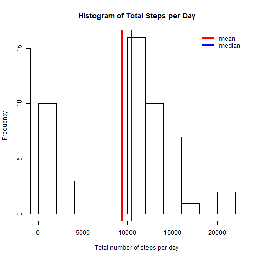
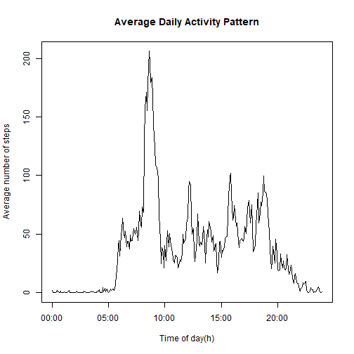
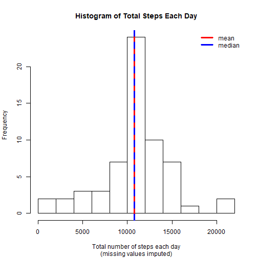
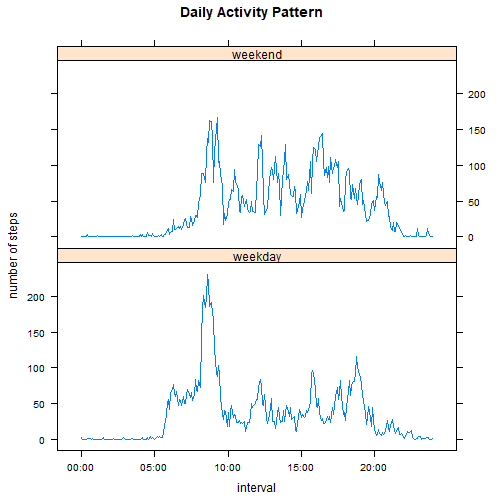

Reproducible Research: Course Project 1
=========================================


The data for this assignment was collected from a personal activity monitoring device for two months (2012-10-01-2012-11-30) and includes the number of steps taken in 5-minute interval.

First, echo=TRUE is set to make sure that all the code chunks are visible.


```r
knitr::opts_chunk$set(echo = TRUE)
```

## Loading and preprocessing the data

The data flie activity.csv is downloaded and unziped from the provided link and loaded into a data frame. The class for each column is specified by using colClasses argument in read.csv() function. By observing the data in the interval column, we can see it is formatted in HourMinutes such as 50, 55, 100, 105. The values in this column are transformed into minutes passed. The structure of the data frame is displayed below. 


```r
url<-"https://d396qusza40orc.cloudfront.net/repdata%2Fdata%2Factivity.zip"
download.file(url, destfile="./Factivity.zip")
unzip("./Factivity.zip", exdir="./data")
data<-read.csv("./activity.csv", header=TRUE, sep=",", colClasses=c("integer", "Date","integer"))
data$interval<-60*floor((data$interval+1)/100) + (data$interval %% 100)
str(data)
```

```
## 'data.frame':	17568 obs. of  3 variables:
##  $ steps   : int  NA NA NA NA NA NA NA NA NA NA ...
##  $ date    : Date, format: "2012-10-01" "2012-10-01" ...
##  $ interval: num  0 5 10 15 20 25 30 35 40 45 ...
```
## What is mean total number of steps taken per day?

The total number of steps taken per day are summed up with tapply() function, and the mean and median are calculated.


```r
sumday<-tapply(data$steps, data$date, sum, na.rm=TRUE) 
mean_sumday<- round(mean(sumday))
mean_sumday
```

```
## [1] 9354
```

```r
median_sumday<-round(median(sumday))
median_sumday
```

```
## [1] 10395
```

The total number of steps taken per day is calculated and shown in the histogram below. The mean value of the total number of steps taken per day is 9354 and highlighted by a vertical line in red. The median number of steps taken each day is 1.0395 &times; 10<sup>4</sup> and highlighted by a vertical line in blue. 


```r
hist(sumday, xlab="Total number of steps per day", 
     main="Histogram of Total Steps per Day", breaks=10)
abline(v=mean_sumday, col="red", lwd=3)
abline(v=median_sumday, col="blue", lwd=3)
legend("topright", col=c("red","blue"), legend=c("mean","median"), bty="n", lwd=3)
```



## What is the average daily activity pattern?

The average number of steps taken for every 5-minute interval is calculated by using tapply() function. A time series plot for the average daily activity pattern is displayed below.    


```r
intervalave<-tapply(data$steps, data$interval, mean, na.rm=TRUE)
intervalnum<-as.numeric(names(intervalave))/60
plot(intervalnum, intervalave, type="l", xaxt="n", 
     xlab="Time of day(h)", ylab="Average number of steps", 
     main="Average Daily Activity Pattern")
axis(1, at=0:4*5, labels=c("00:00", "05:00","10:00", "15:00", "20:00"))
```



The 5-minute interval with maximum number of steps is calculated as follows. It is processed into hours and transformed to Hour:Minute formate by using sprintf() function.   


```r
maxinterval<-as.numeric(names(intervalave)[intervalave==max(intervalave)])
maxintervalseq<-maxinterval/5
maxintervaltime<-sprintf("%02d:%02d",floor(maxinterval/60), maxinterval %% 60)
maxintervaltime
```

```
## [1] "08:35"
```
On the average across all the days in the dataset, the 103th 5-minute interval (08:35) contains the maximum number of steps 206. 

## Imputing missing values

The total number of missing values in the dataset is calculated and displayed as follows:


```r
sumna<-sum(is.na(data))
sumna
```

```
## [1] 2304
```
From calculation above, we can see that there are 2304 missing values in the dataset. By calculating the missing values in the column "steps", we conclude that all the missing values come from this column. My strategy is to use the mean for that 5-minute interval to fill in all the missing values in the dataset. First the indices of missing values in the column is determined. Then a vector that has same length with missing data set is set and a new data frame which is equal to the original dataset is created. Finaly, The mean for 5-minute interval is used to fill in the missing values.    


```r
sum(is.na(data$steps))
```

```
## [1] 2304
```

```r
seq<-which(is.na(data$steps))
itv<-c(rep(intervalave, length(seq)/length(intervalave))) 
datanew<-data
datanew[seq,1]<-itv[names(itv)==as.character(datanew[seq,3])]
```
For the new data set with missing values filled, the total number of steps taken each day is summed up using the tapply() function. The mean and median of total number of steps taken each day are calculated. 


```r
sumnew<-tapply(datanew$steps, datanew$date, sum)

mean_sumnew<-round(mean(sumnew))
mean_sumnew
```

```
## [1] 10766
```

```r
median_sumnew<-round(median(sumnew))
median_sumnew
```

```
## [1] 10766
```
The total number of steps each day is shown in a histogram below. The mean value of total number of steps taken each day is 1.0766 &times; 10<sup>4</sup> and highlighted by a vertical line in red. The median value is 1.0766 &times; 10<sup>4</sup> and highlighted by a vertical line in blue. The mean and the median are overlapped. Comparing to the original data set, both mean and median has increased. The mean value has increased more than the median value.  


```r
hist(sumnew, 
     xlab="Total number of steps each day", 
     sub="(missing values imputed)", 
     main="Histogram of Total Steps Each Day", breaks=10)
abline(v=mean_sumnew, col="red", lwd=3)
abline(v=median_sumnew, col="blue", lwd=3, lty=2)
legend("topright", col=c("red","blue"), legend=c("mean","median"), bty="n", lwd=3)
```



For the two data sets (data and datanew), the total daily number of steps are calculated. 


```r
totalsteps<-sum(data$steps, na.rm=TRUE)
totalsteps
```

```
## [1] 570608
```

```r
totalnew<-round(sum(datanew$steps))
totalnew
```

```
## [1] 656738
```

By imputing the missing data, the total daily number of steps increases from 570608 to 6.56738 &times; 10<sup>5</sup>. 

## Are there differences in activity patterns between weekdays and weekends?

A new factor variable in the data set is created with two levels "weekday" and "weekend". Based on this factor variable, the average number of steps taken 5-minute interval across weekdays and weekends are calculated and subsetted to a new data frame using aggregate() function. A xyplot() function is applied to plot the comparison for the average number of steps taken per 5-minute interval across weekdays and weekends.     


```r
datanew$weekday<-factor(weekdays(datanew$date) %in% c("Saturday", "Sunday"), 
                        labels=c("weekday","weekend"), ordered=FALSE)
avenew<-aggregate(list(steps=datanew$steps), list(interval=datanew$interval, weekday=datanew$weekday), mean)

library(lattice)
xyplot(steps~interval|weekday, data=avenew, 
       scales=list(x=list(at=0:4*300, labels=c("00:00", "05:00", "10:00", "15:00", "20:00"))),
       layout=c(1,2), type="l", ylab="number of steps", main="Daily Activity Pattern")
```



The maximum value on weekdays is higher than the one on weekends. More activities can be observed in the mornings of weekdays than the weekends. 


